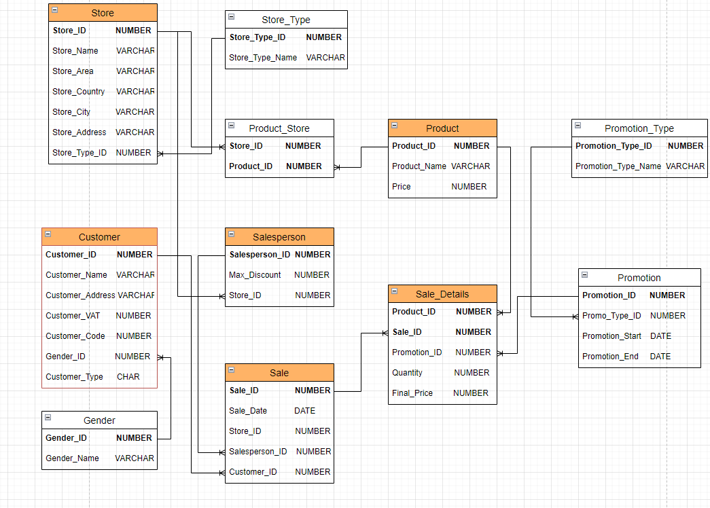

# IM 2024 Project

A small project that showcases Python, REST API (FastAPI), Docker, and SQL (Postgres) in a microservice architecture.

## Features

- Microservice architecture with separate services for each concern.
- RESTful API endpoints for managing retail operations.
- Containerized services for easy deployment and scaling.

## Data Model



## Installation

### Requirements

- Docker Desktop or similar container tool for local development.

### Setup

Execute the following commands in the root directory of the project:

```bash
docker-compose up -d
```


### Usage

To reach the Swagger UI, open the following link in your web browser:

- http://localhost:8080/api/v1/retail/docs

For detailed API usage and endpoint information, refer to the Swagger documentation linked above.